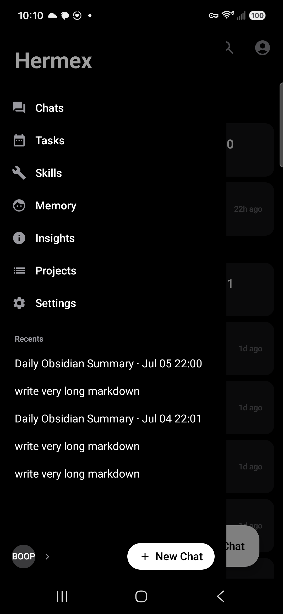
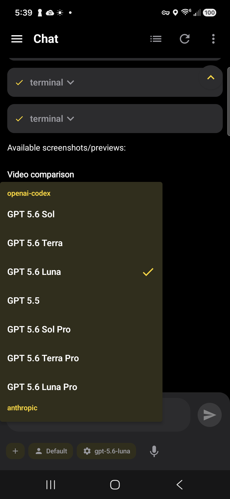
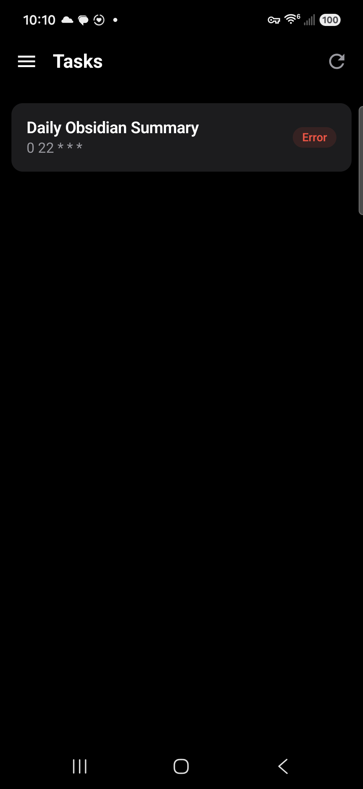
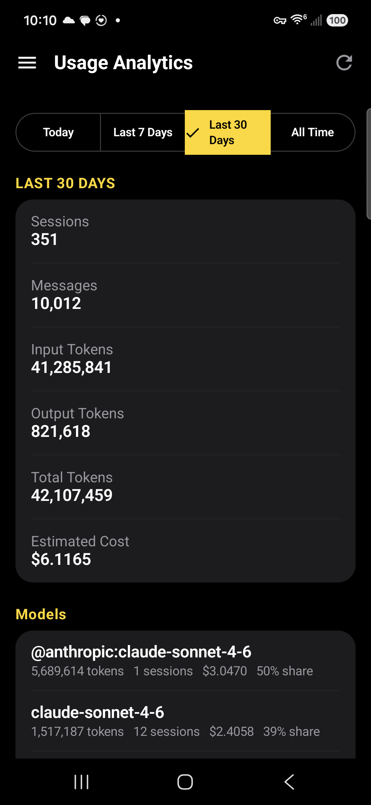
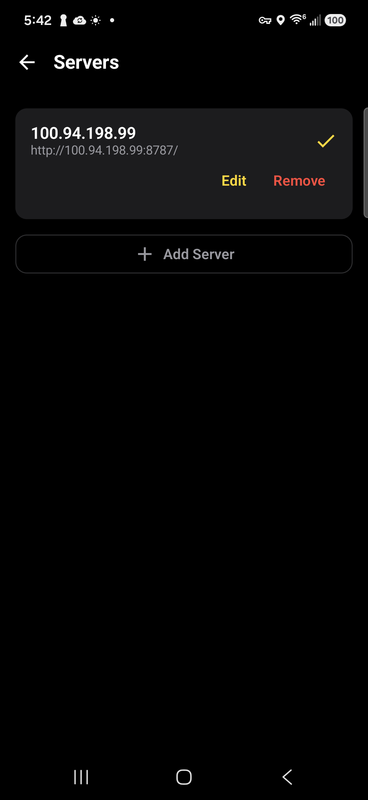
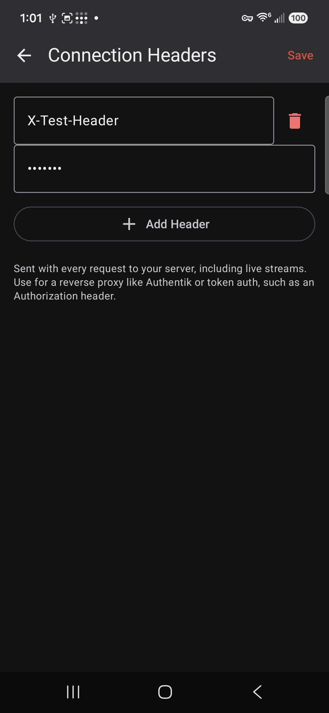
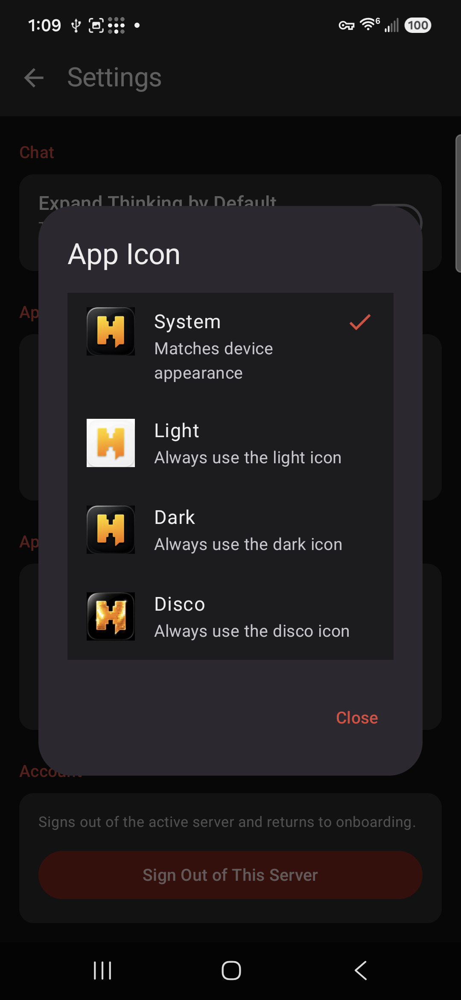
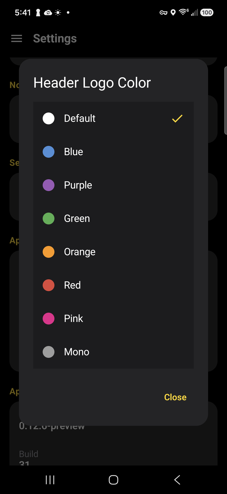
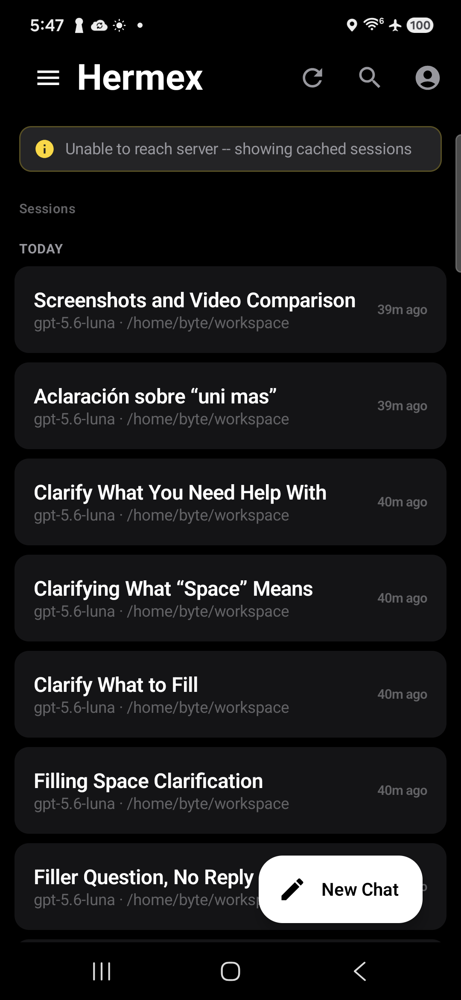

# Hermex Android

Native Android client for Hermex/Hermes self-hosted AI servers.

Hermex Android is the operator-grade mobile control plane for [Hermes](https://github.com/nesquena/hermes-webui)
servers — a calm, dense, native surface for sessions, chat, tools, projects,
tasks, skills, memory, insights, and server administration. It runs against
real self-hosted backends, not mocks or prototypes.

## Status

- **Current release:** v0.12.0-preview
- **Status:** 1.0 hardening complete (21 slices)
- **Next milestone:** v1.0.0-rc1
- **Distribution:** GitHub Releases
- **Play Store:** planned after stable 1.0 ships

### Gateway-only / OpenAI-compatible servers

Hermex Android 1.0 targets the full Hermex/Hermes app-server API. A plain Hermes Gateway or OpenAI-compatible server may expose `/v1/chat/completions`, but it may not expose app-level routes such as `/api/auth/status`, sessions, projects, tasks, memory, insights, and settings. Gateway-only mode is planned for a future 1.1+ compatibility release.

## Overview

Hermex Android connects to one or more Hermex/Hermes servers with real
authentication, real SSE streaming, and real persistent state. It is designed
for daily operator use on a phone or tablet: switch servers, manage sessions,
chat with streaming responses, browse workspaces, run projects/tasks/skills,
inspect memory and insights, and configure the app itself.

The app is built to match the shared Hermex design system across iOS and
WebUI where possible, adapted to native Android idioms (Compose, Material 3,
edge-to-edge, system navigation).

## Features

### Core chat

- Real server authentication and session loading
- Session list with day-grouped recents (Today / Yesterday / date)
- SSE token streaming with stop control and reattach after background
- Chat-scoped model and profile switching
- Attachments with hardened I/O dispatcher (no ANR on large files)
- Markdown rendering: bold, italic, lists, inline and fenced code
- Tool call cards with status pills; collapsible reasoning blocks
- Approval and clarification request overlays mid-stream
- Slash command autocomplete and execution (`/continue`, `/summarize`, ...)
- Voice input with runtime permission flow and education Snackbar
- Copy message via long-press; friendly retry on failed sends
- "Session expired" re-auth banner with auto-focused password

### Server / self-hosting

- Multi-server switching
- Per-server cookies
- Per-server custom HTTP headers (Authorization, X-Api-Key, etc.)
- Header value masking in UI with per-row reveal toggle
- HTTP URL policy: HTTPS always allowed; HTTP LAN/localhost allowed with
  warning; **HTTP public blocked** before save
- Self-signed certificate detection with clear user messaging
- Test Connection in the server editor with success/error indicators
- Safer logging suppression (verbose/debug stripped in release builds)

### App surfaces

- **Projects** — create, rename, delete, color tag
- **Profiles** — switch between configured server profiles
- **Tasks** — scheduled/cron job list and detail view
- **Skills** — browse server skills by category with detail view
- **Memory** — view server-stored memory content
- **Insights** — usage analytics by time range and model
- **Settings** — active server, default model, custom headers, notification
  preferences, app icon variant, header logo color, sign-out, copy diagnostics
- **Share target** — accept shared text, single file, and multiple files
  (`text/plain`, `*/*`, `SEND_MULTIPLE`) with destination picker
- **Notifications + widget** — notification channel registered, widget
  provider registered, deep-link entry points

### Local persistence

- Room-based offline cache for session list and chat/message history
- Per-server cache isolation; per-server logout vs forget distinction
- Cache-first load with fallback banners
- Startup pruning: 50 most recent sessions or 90 days (whichever is stricter)
- Full cache audit completed for 1.0 (migration, isolation, logout, pruning)

### UI / polish

- Jetpack Compose + Material 3
- Hermex design system: tokens, shape, typography
- Runtime app icon switching (Light / Dark / Disco / System) using iOS assets
- Header logo color theming (drives home screen wordmark tint)
- Composer design-system alignment with capsule icon buttons
- Slide-out navigation drawer; hamburger from every screen
- Shared `HermexErrorBanner` composable with retry across control-plane screens
- Refresh buttons on Projects, Task Detail, Skill Detail

## Release status / 1.0 path

The 21-slice 1.0 hardening roadmap is complete. v0.12.0-preview is the
hardening cut. v1.0.0-rc1 is the next validation release. Final v1.0.0
follows tester approval. Play Store submission comes after the stable
GitHub release.

### Completed hardening highlights (v0.12.0-preview)

- R8 / minified release build with comprehensive ProGuard rules
- Attachment I/O dispatcher fix (ANR elimination on large files)
- HTTP URL policy classifier with public-HTTP blocking
- SSL error detection for self-signed certificates
- Custom header value masking by default
- Release logging suppression via R8
- Composer, slash-command, and voice polish
- Stream reattach regression coverage
- Large-session stability documentation
- Offline cache audit and server-isolation tests
- Share target regression verification
- Notifications and widget QA verification
- Full regression checklist (40+ scenarios)
- Test suite hardening (3 consecutive green runs)
- Release packaging with SHA-256 hashes and version tagging

### Deferred to 1.1+

- Git write actions: commit, push, pull, checkout, discard
- Play Store submission
- Larger workspace / git panel expansion
- Goal controls in composer
- Additional iOS parity polish

## Screens / app areas

- Chat
- Sessions
- Projects
- Profiles
- Tasks
- Skills
- Memory
- Insights
- Settings
- Server management

## Screenshots

| | |
|---|---|
| Sessions | Navigation Drawer |
|  |  |
| Chat | Model Picker |
|  |  |
| Projects | Insights |
|  |  |
| Tasks | Settings |
|  |  |
| Multi-server | Connection Headers |
|  |  |
| App Icon Picker | Header Logo Color |
|  |  |
| Offline Cache | Workspace |
|  |  |

Additional screenshots and release assets live in `release-artifacts/screenshots`.

## Getting APKs

Preview and release-candidate APKs are published through GitHub Releases:

    https://github.com/ComputerByte/hermex-android/releases

Download the newest release or RC asset, then sideload. Android may require
"install unknown apps" permission for the installer you use (Files, browser,
etc.) — this is expected for sideloaded builds. Prefer the newest release
asset when present.

## Build from source

    ./gradlew assembleDebug
    ./gradlew test
    ./gradlew assembleRelease

## QA / release checklist

- [ ] Full unit tests pass (`./gradlew test`)
- [ ] Debug build passes (`./gradlew assembleDebug`)
- [ ] Release build passes (`./gradlew assembleRelease`)
- [ ] Release APK installs on real device
- [ ] Login and session persistence verified
- [ ] Session list loads
- [ ] Chat streaming works
- [ ] Stop / send works (including reattach)
- [ ] Model switching works
- [ ] Attachments path smoke tested
- [ ] Slash commands smoke tested
- [ ] Share target smoke tested (text, file, multi-file)
- [ ] Offline cache checked
- [ ] Settings / about / version checked
- [ ] APK SHA-256 hashes generated
- [ ] Git tag pushed
- [ ] GitHub release created

## Security / privacy notes

- Server cookies are stored per server and cleared on logout or
  per-server removal.
- Sensitive custom header values (Authorization, X-Api-Key) are masked by
  default in the UI and revealed only on explicit tap.
- Release logging rules strip verbose / debug log calls to avoid leaking
  sensitive runtime data.
- HTTP server URLs are subject to policy checks: HTTPS is unrestricted;
  HTTP LAN is allowed with a warning; public HTTP is blocked.
- Prefer HTTPS for any remote server. Use a reverse proxy with Let's
  Encrypt for self-hosted deployments.
- Self-hosted LAN HTTP may be supported with clear warnings depending on
  configuration; the user is informed before any connection attempt.
- Private signing material (keystores, passwords, signing properties) must
  never be committed.

## Contributing / project notes

- Open PRs against `master` unless a release branch is active.
- Keep PRs scoped to one feature / fix / slice.
- Include test results and, where relevant, real-device verification notes.
- Avoid new feature work during RC / final release stabilization.
- See `qa/1.0-regression-checklist.md`, `docs/`, and `CHANGELOG.md` for the
  current state of QA, feature documentation, and release history.

## License

See the repository license file, if present.
