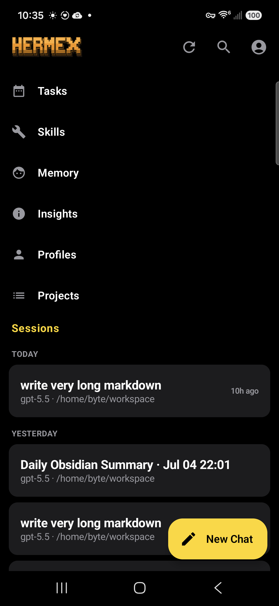
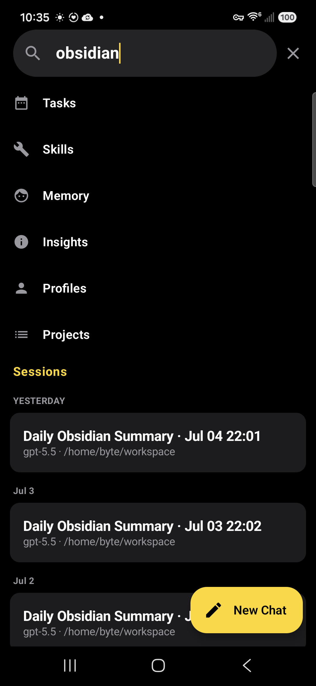
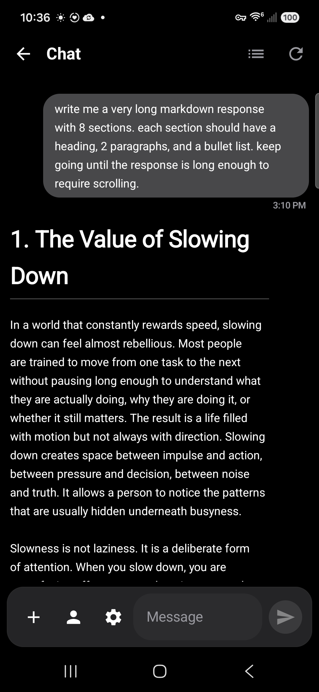
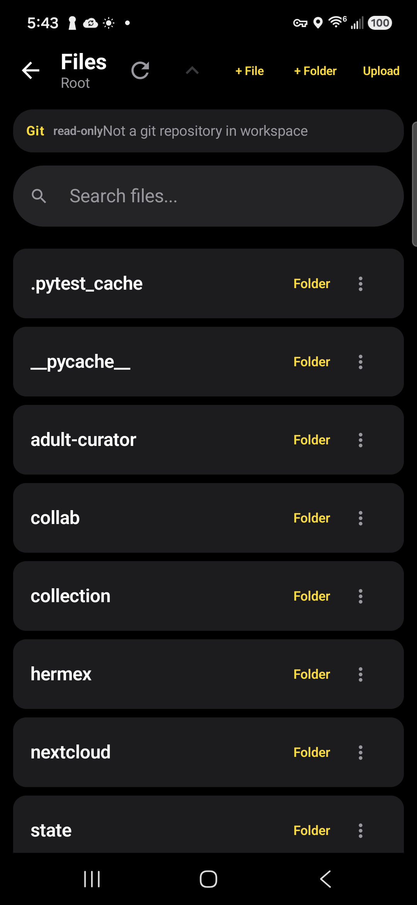
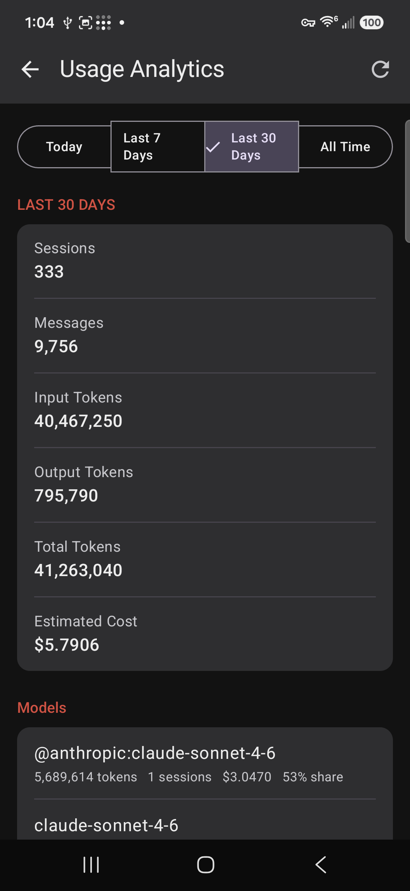
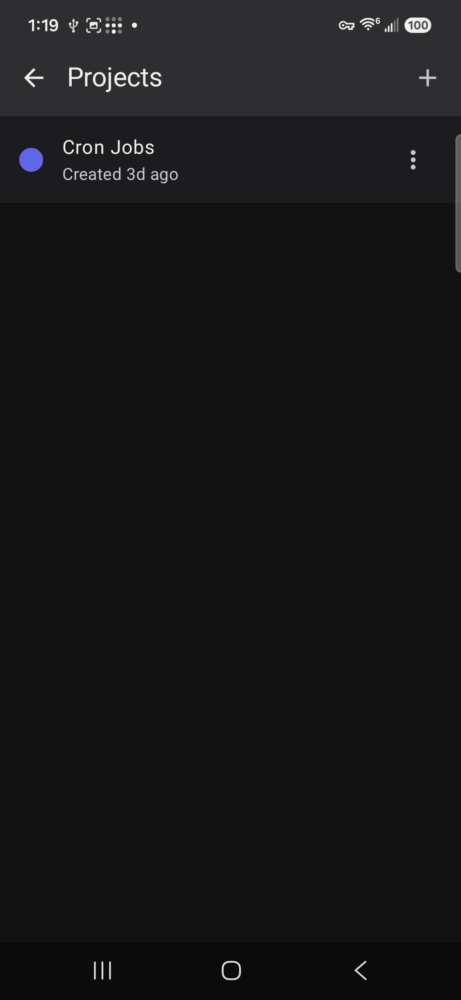

# Hermex Android

Hermex is the native Android control plane for a self-hosted [Hermes](https://github.com/nesquena/hermes-webui)
AI agent server, built with Kotlin and Jetpack Compose — the Android counterpart to the iOS
Hermex app.

## Status

**Active development / UI preview build — current version: v0.9.3-ui-preview.**

This is not a final Play Store release yet, but the app is already running on real Android
hardware against a real Hermes server. A recent pass refreshed the app's home/session-list visual
hierarchy (Hermex wordmark branding, session date grouping, refined navigation) — see the
Screenshots section below for the current look. See `API_CONTRACT.md` for the verified server API
contract this app targets.

## Current Features

- Native Android / Jetpack Compose UI, styled from a shared Hermex design system (colors, shape,
  typography tokens) with a live-composited wordmark, bolder navigation typography, and
  TODAY/YESTERDAY/date session grouping in the home/session list
- Real server authentication and session loading
- Sessions & Chat: SSE token streaming, a stop control for in-progress runs, session search, and a
  refreshed "New Chat" affordance
- Markdown rendering in chat (bold/italic, inline & fenced code, lists), plus tool call cards and
  collapsible reasoning blocks; copy message via long-press
- Attachment upload: pick a file from the composer, it uploads immediately, and is attached to
  the next sent message (with upload-failure handling that preserves the composer's text/state)
- Session-scoped workspace/file browser: folder navigation, text file preview and editing,
  create/rename/move/delete, and git status/diff viewing for git-backed workspaces
- Tasks: scheduled/cron job list and detail view
- Skills: browse the server's configured skills by category, with detail view
- Memory: view the server's stored memory content
- Profiles: switch between configured server profiles (model, skills, provider)
- Projects: create and browse projects that group sessions
- Insights: usage analytics (sessions, messages, token counts, estimated cost) by time range and
  model
- Chat-scoped model switching (updates a session in place, matching iOS)
- Multi-server switching, per-server cookies, and per-server custom HTTP headers
- Runtime app icon switching (Light/Dark/Disco/System), using the real iOS icon assets
- Header logo color theming (also drives the home screen wordmark's tint)
- Room-based offline cache for the session list, with per-server cache isolation
- Room-based offline cache for chat/message history, with cache-first load and fallback banners
- Offline cache retention: pruned once per app startup, per server, to the 50 most recently
  active sessions or 90 days old (whichever is stricter); orphaned cached messages are swept too
- Android share target support for shared text, single files, and multiple files
- Deep link entry routes for `hermex://` and `hermes-agent://`
- Notification channel and notification routing foundation
- Home screen widget entry surface
- Settings: active server details, default model, custom headers, notification preferences, app
  icon/header color appearance, and sign-out

## In Progress / Not Finished Yet

- Workspace actions polish: copy path, raw/open/download support
- Full chat composer redesign per the design system (pill-shaped chip row, capsule icon buttons,
  translucent field architecture) — the composer field's shape/radius is aligned to design tokens,
  but not the wider component architecture
- More iOS parity polish
- Play Store release hardening (this preview ships a debug build; release signing isn't set up yet)

## Download

A preview APK is available under [GitHub Releases](../../releases).

This is a manual-install APK, not distributed through the Play Store. Android will warn that it's
from an unknown source — that's expected for a debug preview build.

## Screenshots

| Home / Sessions | Search |
|---|---|
|  |  |

| Chat | Workspace |
|---|---|
|  |  |

| Insights | Projects |
|---|---|
|  |  |

More screenshots (multi-server, connection headers, header logo color, chat model picker, app
icon picker, offline cache banner) are in
[`release-artifacts/screenshots/`](release-artifacts/screenshots).

## Requirements

- JDK 17+ (developed against Temurin/OpenJDK 21)
- Android SDK (`compileSdk`/`targetSdk` 36, `minSdk` 26)

## Build

```bash
./gradlew test
./gradlew assembleDebug
```
